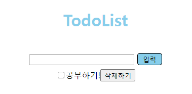

# TodoList

| 날짜  | 내용                                                         |                    |
| ----- | ------------------------------------------------------------ | ------------------ |
| 06.06 | 간단한 TodoList 만들기 :arrow_right: 검색창에 TodoList를 작성하고, 입력 버튼을 누르면 하단의 TodoList에 내용이 작성됨. https://velog.io/@cheesecookie/JavaScript%EB%A1%9C-%EA%B0%84%EB%8B%A8%ED%95%9C-To-Do-List-%EB%A7%8C%EB%93%A4%EA%B8%B0 | :white_check_mark: |
| 06.07 | 간단한 TodoList 만들기 :arrow_right: TodoList를 한 번 클릭하면 줄이 그어지고, 더블 클릭 하면 삭제됨. | :white_check_mark: |
|       | 간단한 TodoList 만들기_ver2 :arrow_right: 체크 박스와 삭제 버튼 만들기  | :white_check_mark: |

